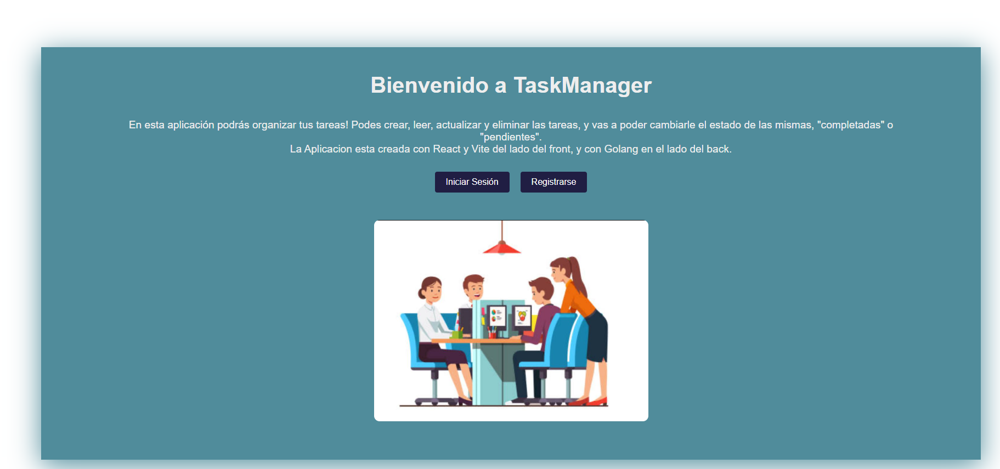

# TaskManager API

TaskManager es una API RESTful para gestionar tareas, desarrollada en Go para el backend y React Vite para el front. Permite a los usuarios registrarse, autenticarse y manejar sus tareas de manera eficiente.

## Características

- **Autenticación**: Registro de usuarios, inicio de sesión y manejo de sesiones mediante tokens JWT.
- **Gestión de Tareas**: CRUD completo (Crear, Leer, Actualizar, Eliminar) para tareas.
- **Protección de Rutas**: Solo los usuarios autenticados pueden acceder a las rutas de gestión de tareas.

## Requisitos

- Go 1.18 o superior
- PostgreSQL
- Librerías:
  - `github.com/gorilla/mux`
  - `github.com/joho/godotenv`
  - `golang.org/x/crypto/bcrypt`
  - `gorm.io/gorm`
  - `gorm.io/driver/postgres`

## Instalación

1. Clona este repositorio:

    ```sh
    git clone https://github.com/tu-usuario/taskmanager.git
    cd taskmanager
    ```

2. Crea un archivo `.env` en la raíz del proyecto con las siguientes variables de entorno:

    ```plaintext
    DB_HOST=localhost
    DB_USER=tu-usuario
    DB_PASSWORD=tu-contraseña
    DB_NAME=taskmanager
    DB_PORT=5432
    JWT_SECRET_KEY=tu-secreto
    ```

3. Instala las dependencias del backend:

    ```sh
    go mod tidy
    ```

4. Inicia el servidor del backend:

    ```sh
    go run cmd/main.go
    ```

5. Clona el repositorio del frontend (si está en un repositorio separado) y navega a la carpeta del frontend:

    ```sh
    git clone https://github.com/tu-usuario/taskmanager-frontend.git
    cd taskmanager-frontend
    ```

6. Instala las dependencias del frontend:

    ```sh
    npm install
    ```

7. Inicia el servidor del frontend:

    ```sh
    npm run dev
    ```

## Endpoints

### Autenticación

 

- **Registro de usuario**
  - `POST /register`
  - Cuerpo de la solicitud:
    ```json
    {
      "name": "John Doe",
      "email": "john.doe@example.com",
      "password": "your-password"
    }
    ```

    

- **Inicio de sesión**
  - `POST /login`
  - Cuerpo de la solicitud:
    ```json
    {
      "email": "john.doe@example.com",
      "password": "your-password"
    }
    ```

 


### Gestión de Tareas

 

- **Obtener todas las tareas**
  - `GET /tasks`

- **Obtener una tarea por ID**
  - `GET /tasks/{id}`

- **Crear una nueva tarea**
  - `POST /createTasks`
  - Cuerpo de la solicitud:
    ```json
    {
      "title": "New Task",
      "description": "Task description"
    }
    ```

- **Actualizar una tarea**
  - `PUT /tasks/{id}`
  - Cuerpo de la solicitud:
    ```json
    {
      "title": "Updated Task",
      "description": "Updated description"
    }
    ```

- **Eliminar una tarea**
  - `DELETE /tasks/{id}`

- **Completar una tarea**
  - `PUT /tasks/{id}/complete`

## Middleware de Autenticación

Para proteger las rutas, se utiliza un middleware que verifica la presencia y validez del token JWT en las solicitudes. Si el token no es válido o no está presente, la ruta devuelve un error 401 Unauthorized.

## Avances en el Frontend

Se han implementado dos componentes principales en el frontend:

### Registro de Usuario (Register)

- **Componente:** `Register`
- **Ruta:** `/register`
- **Descripción:** Este componente permite a los nuevos usuarios registrarse en la aplicación. Los usuarios deben proporcionar su nombre, correo electrónico, contraseña y confirmar su contraseña. El componente realiza una validación básica y envía los datos al backend para crear una nueva cuenta.

### Inicio de Sesión (Login)

- **Componente:** `Login`
- **Ruta:** `/login`
- **Descripción:** Este componente permite a los usuarios existentes iniciar sesión en la aplicación. Los usuarios deben ingresar su correo electrónico y contraseña. El componente envía estos datos al backend para autenticar al usuario y manejar el inicio de sesión.

### Tecnologías Utilizadas

- **React:** Para la construcción de la interfaz de usuario.
- **Redux Toolkit:** Para la gestión del estado de autenticación y manejo de la lógica de registro e inicio de sesión.
- **Axios:** Para realizar solicitudes HTTP al backend.

### Próximos Pasos

- **Implementar la funcionalidad de gestión de tareas en el frontend.**
- **Añadir validaciones adicionales y manejo de errores en el registro e inicio de sesión.**
- **Integrar el sistema de autenticación con las rutas protegidas en la aplicación.**

## Contribuciones

¡Las contribuciones son bienvenidas! Por favor, abre un issue o un pull request para discutir cualquier cambio.
